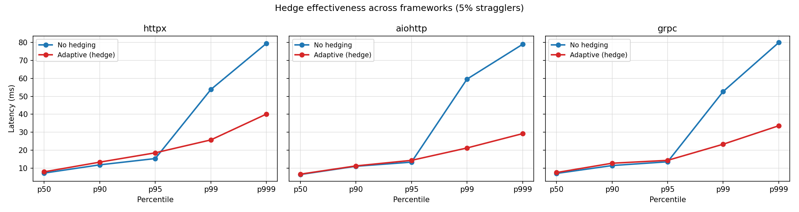

# hedge-python

[English](README.md) | [简体中文](README.zh-CN.md) | **日本語**

[](https://github.com/sunhailin-Leo/hedge-python/actions)
[](#テスト)
[](pyproject.toml)
[](LICENSE)

> 📘 公式ドキュメントは **[英語版](README.md)** が主です。本書は概要をすばやく把握するための日本語訳です。

[bhope/hedge](https://github.com/bhope/hedge) の Python 移植版 ——
**テールレイテンシ最適化のための適応型ヘッジリクエストライブラリ** です。

`hedge-python` は [DDSketch](https://arxiv.org/abs/2004.08604) を用いてホストごとのレイテンシ分布を学習し、
プライマリリクエストが推定 p90 を超えた時点でバックアップリクエストを発射、
さらにトークンバケットでヘッジレートを制限することで、障害時の負荷増幅を防ぎます。
**設定不要** で、**httpx**、**aiohttp**、**niquests**、**tornado**、**gRPC**（unary + server-streaming）を第一級でサポートします。
`http_client` パラメータ経由で **OpenAI Python SDK** とのシームレスな統合もサポートしています。

Dean & Barroso の [_The Tail at Scale_](https://research.google/pubs/the-tail-at-scale/)（CACM 2013）に着想を得ています。

---

## なぜヘッジが必要か

少数の遅いレスポンスがユーザー体感レイテンシを支配します。
ヘッジは、プライマリリクエストが想定締切を超えた瞬間に複製リクエストを発射し、
先に返ってきた方を採用、もう片方をキャンセルします。

**5% のストラグラー（10× 遅延）を含むベンチマーク結果:**



| フレームワーク | 設定                |  p50  |  p90  |   p95  |   p99  |  p999   | オーバーヘッド |
|---------------|---------------------|-------|-------|--------|--------|---------|----------------|
| httpx         | ヘッジなし          |  5.8  | 10.3  |  12.2  |  51.3  |   78.3  |     0.0%       |
| httpx         | **適応ヘッジ**      |  6.2  | 10.5  |  12.1  | **18.8** | **22.2** |     7.0%       |
| aiohttp       | ヘッジなし          |  6.3  | 10.7  |  13.0  |  52.4  |   79.0  |     0.0%       |
| aiohttp       | **適応ヘッジ**      |  6.5  | 11.3  |  13.8  | **20.5** | **25.1** |     4.6%       |
| grpc          | ヘッジなし          |  6.5  | 10.8  |  12.7  |  59.9  |   82.0  |     0.0%       |
| grpc          | **適応ヘッジ**      |  6.9  | 11.6  |  13.7  | **20.4** | **23.5** |     5.6%       |

3 つのフレームワーク全てで p99 レイテンシが **60〜66%** 低下し、
バックエンドへの追加トラフィックは僅か 5〜7% です。
`make bench-multi && make bench-plot` で再現できます。

---

## クイックスタート

```bash
# 必要なフレームワーク向けにインストール
pip install hedge-python[httpx]
pip install hedge-python[aiohttp]
pip install hedge-python[niquests]
pip install hedge-python[tornado]
pip install hedge-python[grpc]
pip install hedge-python[all]   # 全フレームワーク
```

### httpx

```python
import asyncio
import httpx
from hedge import HedgeConfig
from hedge.transport import HedgedHttpxTransport

async def main():
    transport = HedgedHttpxTransport(config=HedgeConfig())
    async with httpx.AsyncClient(transport=transport) as client:
        resp = await client.get("https://api.example.com/data")
        print(resp.status_code)

asyncio.run(main())
```

### aiohttp

```python
import asyncio
from hedge import HedgeConfig
from hedge.transport import HedgedAiohttpSession

async def main():
    async with HedgedAiohttpSession(config=HedgeConfig()) as session:
        resp = await session.get("https://api.example.com/data")
        data = await resp.json()
        print(data)

asyncio.run(main())
```

### gRPC（Unary）

```python
import grpc.aio
from hedge import HedgeConfig
from hedge.interceptor import HedgedUnaryInterceptor

async def make_channel():
    return grpc.aio.insecure_channel(
        "localhost:50051",
        interceptors=[HedgedUnaryInterceptor(config=HedgeConfig(estimated_rps=500))],
    )
```

### gRPC（Server Streaming —— LLM 推論、ログ追従など）

```python
import grpc.aio
from hedge import HedgeConfig
from hedge.interceptor import HedgedServerStreamInterceptor

async def make_channel():
    return grpc.aio.insecure_channel(
        "localhost:50051",
        interceptors=[HedgedServerStreamInterceptor(config=HedgeConfig())],
    )
```

### niquests

```python
import asyncio
from hedge import HedgeConfig
from hedge.transport import HedgedNiquestsSession

async def main():
    async with HedgedNiquestsSession(config=HedgeConfig()) as session:
        resp = await session.get("https://api.example.com/data")
        print(resp.status_code)

asyncio.run(main())
```

### tornado

```python
import asyncio
from hedge import HedgeConfig
from hedge.transport import HedgedTornadoClient

async def main():
    async with HedgedTornadoClient(config=HedgeConfig()) as client:
        resp = await client.fetch("https://api.example.com/data")
        print(resp.code)

asyncio.run(main())
```

### OpenAI SDK

OpenAI Python SDK は内部で httpx を使用しているため、`http_client` パラメータ経由で
`HedgedHttpxTransport` を直接注入できます：

```python
import httpx
from openai import AsyncOpenAI
from hedge import HedgeConfig
from hedge.transport import HedgedHttpxTransport

transport = HedgedHttpxTransport(config=HedgeConfig(percentile=0.95))
client = AsyncOpenAI(
    api_key="sk-...",
    http_client=httpx.AsyncClient(transport=transport),
)
```

> **注意**: OpenAI のコア API（Chat Completions、Embeddings など）は POST を使用するため、
> デフォルトではヘッジ **されません** —— 二重課金を回避するためです。GET エンドポイント
>（モデル一覧など）のみがヘッジされます。完全な例は
> [`examples/openai_hedged.py`](examples/openai_hedged.py) を参照してください。

server-streaming におけるヘッジ信号は **TTFM（Time To First Message）** です。
プライマリストリームが推定 p90 までに最初の chunk を返さなければ、バックアップストリームを起動します。
先に最初の chunk を返した側が勝ち、以降のストリーミングを引き継ぎます。
敗者は通信レイヤで（gRPC の `Call` も含めて）キャンセルされます。

> 各フレームワークの実行可能サンプルは [`examples/`](examples/) にあります。
> gRPC サンプルは **完全に自己完結**（ローカルサーバを起動 + ストラグラー注入）しているため、外部依存なしでヘッジ動作を確認できます。
> 詳細は [`examples/README.md`](examples/README.md) を参照してください。

---

## 仕組み

### 1. DDSketch 分位点推定器

ターゲットホストごとに `WindowedSketch`（30 秒ごとにローテートする 2 つの DDSketch）を保持します。
DDSketch は対数バケットマッピングにより **相対誤差保証** を提供 —— 任意の分位点推定値は真値の ±1% 以内に収まり、これは元の分布形状に依存しません。

### 2. 適応的トリガ

各リクエスト時、トランスポートは sketch から設定済み分位点（既定 p90）を取得します。
プライマリがその締切までに応答しない場合、バックアップリクエストを発射します。
先に到着した応答を返し、敗者はキャンセルされます（ストリームの場合は底層の gRPC `Call` も併せてキャンセル）。

```
              ┌─ プライマリ ─────────── ✓（高速）──→ return
request ──────┤
              └─ p90 後にヘッジ発射 ─── ✗（キャンセル）
```

### 3. トークンバケット予算

ヘッジは `estimated_rps × budget_percent / 100` tokens/秒 のレートで補充されるトークンバケットによって制限されます。
実際の障害発生時にはバケットが枯渇し、ヘッジが自動的に停止 —— インシデントを深刻化させる "負荷倍化スパイラル" を防ぎます。

### gRPC 実装ノート

gRPC の `intercept_unary_unary` continuation はほぼ即座に `Call` オブジェクトを返し、実際の RTT は後続の `await call` で消費されます。
私たちは **両ステップ** を 1 つの asyncio task にまとめることで、ヘッジタイマが真の End-to-End RPC レイテンシを反映するようにしています。
敗者をキャンセルする際は、まず `call.cancel()`（サーバへ通知）を呼び、続いて `task.cancel()`（コルーチン後始末）を呼びます。

---

## 設定

すべてのパラメータは `HedgeConfig` 上にあります:

| パラメータ | 型 | 既定値 | 説明 |
|-----------|----|--------|------|
| `percentile` | `float` | `0.90` | ヘッジトリガとして使う sketch の分位点 |
| `max_hedges` | `int` | `1` | 1 コール内の同時ヘッジ最大数 |
| `budget_percent` | `float` | `10.0` | 全トラフィックに対するヘッジレートの上限（%） |
| `estimated_rps` | `float` | `100.0` | 想定 RPS。トークンバケット容量を決定 |
| `min_delay` | `float` | `0.001` | ヘッジ遅延の下限（秒） |
| `warmup_requests` | `int` | `20` | 固定遅延を使うウォームアップリクエスト数 |
| `warmup_delay` | `float` | `0.01` | ウォームアップ中の固定ヘッジ遅延（秒） |
| `window_duration` | `float` | `30.0` | sketch ウィンドウのローテーション周期（秒） |
| `stats` | `Stats \| None` | `None` | 観測用にカスタム `Stats` を注入 |

> **`estimated_rps` 調整のヒント**: 実際の RPS に近い値を選ぶと、トークンバケット容量（`rps × budget_percent / 100`）が意味を持ちます。
> 不明な場合は既定の `100.0` から始め、stats スナップショットの `hedge_rate` / `budget_exhausted` を観察してください。

---

## 可観測性

```python
from hedge import HedgeConfig, Stats
from hedge.transport import HedgedHttpxTransport

stats = Stats()
transport = HedgedHttpxTransport(config=HedgeConfig(stats=stats))

# ... 何らかのトラフィックを流した後 ...
snap = stats.snapshot()
print(f"total={snap.total_requests} hedged={snap.hedged_requests}")
print(f"hedge_wins={snap.hedge_wins} primary_wins={snap.primary_wins}")
print(f"budget_exhausted={snap.budget_exhausted}")
print(f"hedge_rate={stats.hedge_rate():.2%}")
```

`Stats` は完全にスレッドセーフで、複数の transport / interceptor 間で共有しメトリクスを集約できます。

---

## ベンチマークとチャート

本プロジェクトには 2 種類のベンチマークが同梱されています:

| コマンド             | 内容                                                                | 出力                                  |
|---------------------|---------------------------------------------------------------------|---------------------------------------|
| `make bench-compare` | httpx のみ: ヘッジなし vs Static 10ms vs Static 50ms vs 適応       | `benchmark/results.csv`               |
| `make bench-multi`   | httpx vs aiohttp vs gRPC、ヘッジなし vs 適応                       | `benchmark/results_multi.csv`         |
| `make bench-plot`    | 両 CSV をチャートに描画                                              | `eval.png`、`eval_multi_framework.png` |

各ベンチは 500 リクエストを `mean=5ms, stddev=2ms` の対数正規レイテンシ + 5% ストラグラー（10× スパイク）で実行します。

---

## 開発

```bash
# uv をインストール（未導入の場合）
curl -LsSf https://astral.sh/uv/install.sh | sh

make install            # uv で全 extras を導入
make lint               # ruff チェック
make typecheck          # mypy
make test               # 全テスト
make test-unit          # ユニットテストのみ
make test-integration   # 結合テスト（httpx / aiohttp / grpcio が必要）
make coverage           # カバレッジレポート（現在 97%）
make bench-multi        # マルチフレームワークベンチ
make bench-plot         # チャート描画
make ci                 # lint + typecheck + test + coverage
```

### テスト

* **ユニットテスト** (`tests/unit/`): DDSketch、トークンバケット、スケジューラ、stats、options、lazy import shim、gRPC interceptor 分岐（fake continuation 利用）。
* **結合テスト** (`tests/integration/`): 実 httpx transport、実 aiohttp session、**実ローカル gRPC サーバ**（`.proto` + 生成 pb2 込み）。
* **ベンチマーク** (`tests/benchmark/`): DDSketch マイクロベンチ、トークンバケットマイクロベンチ、4 構成比較、3 フレームワーク比較。

現在のカバレッジ: **97%**（150 テスト、約 7 秒）。

---

## 変更履歴

リリース履歴は [CHANGELOG.md](CHANGELOG.md) を参照してください。

## 参考文献

- Jeffrey Dean and Luiz André Barroso. ["The Tail at Scale."](https://research.google/pubs/the-tail-at-scale/) *Communications of the ACM*, 56(2):74–80, February 2013.
- Charles Masson, Jee E. Rim, and Homin K. Lee. ["DDSketch: A Fast and Fully-Mergeable Quantile Sketch with Relative-Error Guarantees."](https://arxiv.org/abs/2004.08604) *Proceedings of the VLDB Endowment*, 12(12):2195–2205, 2019.

## ライセンス

`hedge-python` は [MIT License](LICENSE) の下で公開されています。
